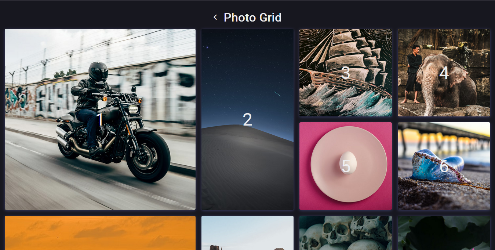

<h1 align="center">🔳 Grid</h1>

  A few pages made to practice dislay grid

<h2 align="center">
  
</h2>

  <a href="#tech">Technologies</a> •
  <a href="#author">Author</a>

---

<h2 id="tech">🚀 Technologies </h2>

<h2 id="author">👤 Author </h2>

  Made with 💛 by Davyd Souza  
  
  
  

