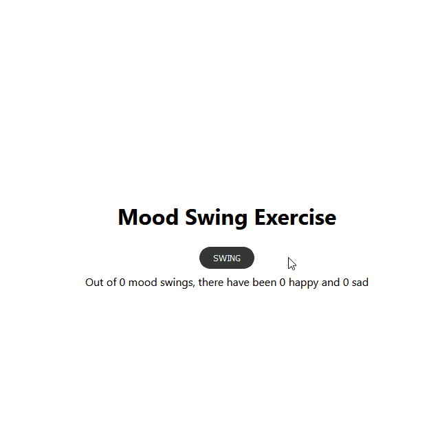

<h1 align="center">🙃 Mood Swing</h1>

    Click on <em>Swing</em> to randomly update the mood.

  

  <a href="#tech">Technologies</a> •
  <a href="#objective">Objective</a> •
  <a href="#author">Author</a>

---

<h2 id="tech">🚀 Technologies </h2>

<h2 id="objective">🎯 Objective </h2>

    This exercise was made in order to understand React's state.  
    After you click on <em>Swing</em> it'll show a random mood between <em>happy</em> and <em>sad</em>. The application keeps track of the total of mood swings and each individual mood.

<h2 id="author">👤 Author </h2>

  Made with 💛 by Davyd Souza  
  
  
  

